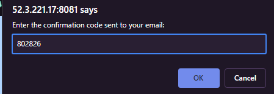
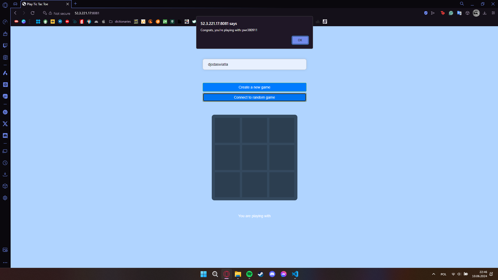

# *Zuzanna Aszkiełowicz - Cognito, Terraform, TicTacToe*

- Course: *Cloud programming*
- Group: Tuesday 11:15-13:00
- Date: June 3, 2024

## Environment architecture
### Frontend

- **Port**: 8081
- **Technologies Used**: HTML, CSS, JavaScript

The frontend of the application is served on port 8081. It is built using standard web technologies: HTML for the structure, CSS for styling, and JavaScript for interactivity and handling user inputs.

### Backend

- **Port**: 8080
- **Framework**: Spring Boot

The backend of the application is a Spring Boot application that listens on port 8080. It communicates with AWS Cognito for user authentication.

### AWS Cognito Integration

The backend integrates with AWS Cognito for user registration, login, and confirmation. The `CognitoService` class uses the AWS SDK to interact with Cognito's services.

- **User Registration**: Users can register with their email and password. AWS Cognito sends a confirmation code to the user's email.
- **User Login**: Users can log in with their email and password. Upon successful authentication, an ID token is generated.
- **User Confirmation**: Users confirm their registration by providing the confirmation code sent to their email.

### Code Structure

- **Service Layer**: Contains the `CognitoService` class responsible for communicating with AWS Cognito.
- **Controller Layer**: Contains the `AuthController` class that exposes REST endpoints for user authentication.

### Terraform Configuration

The infrastructure is defined using Terraform scripts. Below are the main components:

- **VPC Setup**: 
  - `aws_vpc.my_vpc`: Creates a VPC with a specified CIDR block.
  - `aws_internet_gateway.my_igw`: Attaches an internet gateway to the VPC.
  - `aws_subnet.public_subnet`: Defines a public subnet within the VPC.
  - `aws_route_table.public_route_table` and `aws_route_table_association.public_subnet_association`: Create and associate a route table for internet access.

- **Security Groups**:
  - `aws_security_group.allow_ssh_http`: Security group allowing SSH and HTTP traffic.
  - Ingress rules to allow traffic on ports 8080 and 8081.

- **AWS Cognito**:
  - `aws_cognito_user_pool.main`: Creates a Cognito user pool. Configures the password policy, requiring uppercase, lowercase, numbers, symbols, and setting a minimum length. Defines the email attribute as required and mutable.
  - `aws_cognito_user_pool_client.main`: Creates a user pool client for the application. Enables the application to interact with the user pool.

- **EC2 Instance Setup**:
  - `aws_instance.tf-web-server`: Defines an EC2 instance to host the backend and frontend services.
  - User data script is provided to configure the instance, install necessary software, clone the project repository, and start the services using Docker.

### User Authentication Flow

1. **Register User**:
   - Endpoint: `/auth/register`
   - Method: POST
   - Request Body: `{ "email": "user@example.com", "password": "Password123!" }`
   - Action: Registers the user and sends a confirmation code to their email.

2. **Confirm User**:
   - Endpoint: `/auth/confirm`
   - Method: POST
   - Request Body: `{ "email": "user@example.com", "confirmationCode": "123456" }`
   - Action: Confirms the user's registration.

3. **Login User**:
   - Endpoint: `/auth/login`
   - Method: POST
   - Request Body: `{ "email": "user@example.com", "password": "Password123!" }`
   - Action: Authenticates the user and returns an ID token.

### Frontend Interaction

The frontend communicates with the backend through REST API calls to the authentication endpoints. It handles user inputs for registration, login, and confirmation, and displays appropriate messages based on the backend's response.

### Docker Setup

The project uses Docker and Docker Compose to containerize the application. The Docker setup ensures that the frontend and backend are consistently deployed across different environments.

### Running the Project

1. **Setup Infrastructure**: Use Terraform to provision the required AWS resources.
2. **Configure EC2 Instance**: Ensure the EC2 instance is configured correctly using the provided user data script.
3. **Start Services**: Use Docker Compose to build and start the frontend and backend services.

## Preview

Here's the instance!  

(Different IP because I got so excited that it works that I actually forgot if the game is working itself. Reminded myself later, so I attach the screen from the working game).

## Reflections

- **What did you learn?**
I learnt how to secure my application with AWS Cognito, and also how to set up cognito user pool and client with terraform.
- **What obstacles did you overcome?**
For some reason after adding Cognito, my CORS stopped working, and I had a problem with connecting to the socket.
- **What helped you the most in overcoming obstacles?**
Testing different variants of CORS configuration. And also organizing scripts into separate files, and getting rid of `document.addEventListener("DOMContentLoaded", function() ...`. 
- **Was there something that surprised you?**
That it finished by midnight... Except reflections. I'm sorry, I always forget about them!!