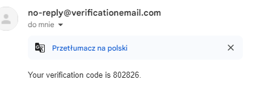
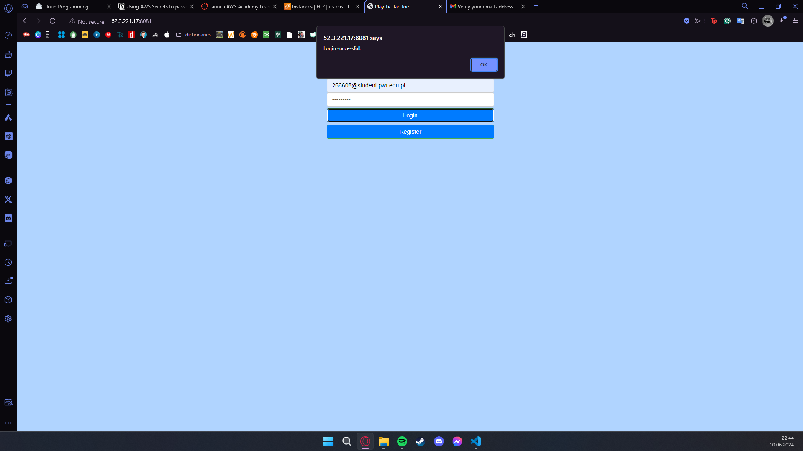
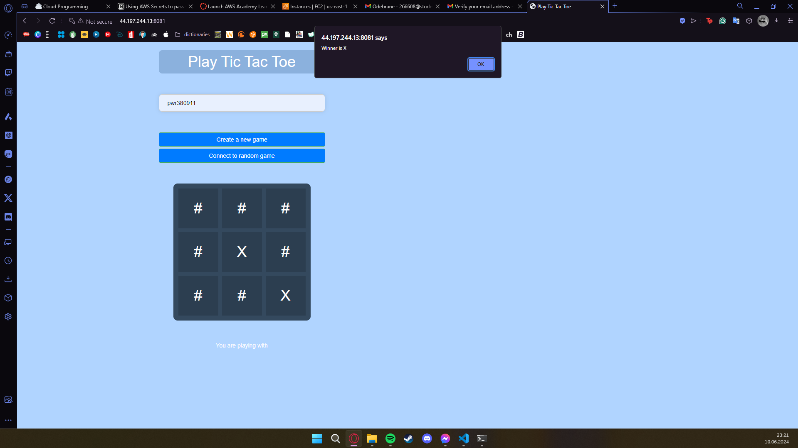

# *Zuzanna Aszkiełowicz - Cognito, Terraform, TicTacToe*

- Course: *Cloud programming*
- Group: Tuesday 11:15-13:00
- Date: June 3, 2024

## Environment architecture
### Frontend

- **Port**: 8081
- **Technologies Used**: HTML, CSS, JavaScript

The frontend of the application is served on port 8081. It is built using standard web technologies: HTML for the structure, CSS for styling, and JavaScript for interactivity and handling user inputs.

### Backend

- **Port**: 8080
- **Framework**: Spring Boot

The backend of the application is a Spring Boot application that listens on port 8080. It communicates with AWS Cognito for user authentication.

### AWS Cognito Integration

The backend integrates with AWS Cognito for user registration, login, and confirmation. The `CognitoService` class uses the AWS SDK to interact with Cognito's services.

- **User Registration**: Users can register with their email and password. AWS Cognito sends a confirmation code to the user's email.
- **User Login**: Users can log in with their email and password. Upon successful authentication, an ID token is generated.
- **User Confirmation**: Users confirm their registration by providing the confirmation code sent to their email.

### Code Structure

- **Service Layer**: Contains the `CognitoService` class responsible for communicating with AWS Cognito.
- **Controller Layer**: Contains the `AuthController` class that exposes REST endpoints for user authentication.

### Terraform Configuration

### Secrets Manager

- **aws_secretsmanager_secret.github_key**
  - Manages a secret in AWS Secrets Manager for storing a private key used to access a GitHub repository.

- **aws_secretsmanager_secret_version.github_key_value**
  - Stores the secret value for the `github_key` secret, loaded from a local file named `repo_key`.

### VPC

- **aws_vpc.my_vpc**
  - Creates a Virtual Private Cloud (VPC) with a CIDR block of `10.0.0.0/16`.
  - Enables DNS support and DNS hostnames.

### Internet Gateway

- **aws_internet_gateway.my_igw**
  - Attaches an internet gateway to the VPC to allow internet access.

### Subnet

- **aws_subnet.public_subnet**
  - Creates a public subnet within the VPC with a CIDR block of `10.0.101.0/24` in the availability zone `us-east-1b`.

### Route Table

- **aws_route_table.public_route_table**
  - Creates a route table for the VPC with a default route to the internet via the internet gateway.

- **aws_route_table_association.public_subnet_association**
  - Associates the public subnet with the public route table.

### Security Groups

- **aws_security_group.allow_ssh_http**
  - Defines a security group that allows inbound SSH and HTTP traffic and all outbound traffic.

- **aws_vpc_security_group_egress_rule.allow_all_traffic_ipv4**
  - Allows all outbound IPv4 traffic.

- **aws_vpc_security_group_ingress_rule.allow_http**
  - Allows inbound HTTP traffic on ports 8080-8081.

- **aws_vpc_security_group_ingress_rule.allow_ssh**
  - Allows inbound SSH traffic on port 22.

### Cognito User Pool

- **aws_cognito_user_pool.main**
  - Creates a Cognito user pool with email as the username attribute and enforces a strong password policy.

- **aws_cognito_user_pool_client.main**
  - Creates a user pool client to interact with the Cognito user pool, allowing various authentication flows.

### EC2 Instance

- **aws_instance.tf-web-server**
  - Launches an EC2 instance with the following configurations:
    - AMI: `ami-0d7a109bf30624c99`
    - Instance Type: `t2.micro`
    - Key Name: `vockey`
    - Subnet: `public_subnet`
    - Security Group: `allow_ssh_http`
    - IAM Instance Profile: `LabInstanceProfile`
    - User Data script to:
      - Install AWS CLI, Docker, Docker Compose, and Git.
      - Retrieve a GitHub private key from Secrets Manager.
      - Configure SSH to use the retrieved private key.
      - Clone a GitHub repository.
      - Modify configuration files to replace `localhost` with the EC2 instance's public IP.
      - Build and run Docker containers.

### User Authentication Flow

1. **Register User**:
   - Endpoint: `/auth/register`
   - Method: POST
   - Request Body: `{ "email": "user@example.com", "password": "Password123!" }`
   - Action: Registers the user and sends a confirmation code to their email.

2. **Confirm User**:
   - Endpoint: `/auth/confirm`
   - Method: POST
   - Request Body: `{ "email": "user@example.com", "confirmationCode": "123456" }`
   - Action: Confirms the user's registration.

3. **Login User**:
   - Endpoint: `/auth/login`
   - Method: POST
   - Request Body: `{ "email": "user@example.com", "password": "Password123!" }`
   - Action: Authenticates the user and returns an ID token.

### Frontend Interaction

The frontend communicates with the backend through REST API calls to the authentication endpoints. It handles user inputs for registration, login, and confirmation, and displays appropriate messages based on the backend's response.

### Docker Setup

The project uses Docker and Docker Compose to containerize the application. The Docker setup ensures that the frontend and backend are consistently deployed across different environments.

### Running the Project

1. **Setup Infrastructure**: Use Terraform to provision the required AWS resources.
2. **Configure EC2 Instance**: Ensure the EC2 instance is configured correctly using the provided user data script.
3. **Start Services**: Use Docker Compose to build and start the frontend and backend services.


## Preview

### Game
Here's the instance! <br>







(Different IP because I got so excited that it works that I actually forgot if the game is working itself. Reminded myself later, so I attach the screen from the working game).


### Services


## Reflections

- **What did you learn?**<br>
I learnt how to enhance the security of my application using AWS Cognito. Also, I gained knowledge in setting up a Cognito user pool and client using Terraform.
- **What obstacles did you overcome?**<br>
After integrating my app with AWS Cognito, I started to have issues with Cross-Origin Resource Sharing (CORS), which caused that my frontend and backend couldn't connect to each other, so that neither could I register/log in nor play the game. Having fixed that, I also started having problems with connecting to the socket, even though the CORS was working properly.
- **What helped you the most in overcoming obstacles?**<br>
Using the Developer Tools Console was crucial in diagnosing the issues. By carefully reading the error messages and investigating the problems, I was able to identify the root causes. For the CORS issue, I initially had this configuration:<br>
```
@Configuration
public class CorsConfig implements WebMvcConfigurer {

    @Override
    public void addCorsMappings(CorsRegistry registry) {
        
        registry.addMapping("/**")
                // .allowedOrigins("http://localhost:8081")
                .allowedOriginPatterns("*")
                .allowedMethods("GET", "POST", "PUT", "DELETE", "OPTIONS")
                .allowedHeaders("*")
                .allowCredentials(true);
    }
}
```
I replaced it with:
```
@Configuration
public class CorsConfig implements WebMvcConfigurer {

    private String frontendUrl = "http://localhost:8081";

    @Bean
    public WebMvcConfigurer corsConfigurer() {
        return new WebMvcConfigurer() {
            @Override
            public void addCorsMappings(CorsRegistry registry) {
                registry.addMapping("/**")
                        .allowedOrigins(frontendUrl)
                        .allowedMethods("GET", "POST", "PUT", "DELETE", "OPTIONS")
                        .allowedHeaders("*")
                        .allowCredentials(true);
            }
        };
    }
}
```
For the WebSocket configuration, I changed:
```
registry.addEndpoint("/gameplay")
            .setAllowedOriginPatterns("*")
            .withSockJS();
```
to:
```
registry.addEndpoint("/gameplay")
            .setAllowedOrigins("http://localhost:8081")
            .withSockJS();
```
These changes resolved the CORS issues but did not fix the socket connection problem. Eventually, I discovered the issue was also in my script, specifically within `document.addEventListener("DOMContentLoaded", function() ....` Removing this event listener allowed the app to start working correctly.
- **Was there something that surprised you?**<br>
That it finished by midnight... Except reflections. I'm sorry, I always forget about them!!